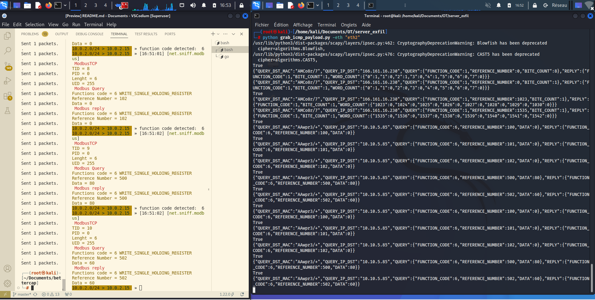

<h1 style="text-align: center;">Bettercap ICS</h1>


<p align="center">
  
</p>

Bettercap_ICS is an unofficial fork of bettercap, with the aim of adding industrial protocols and new exfiltration techniques to the existing framework. 

**WARNING**: This repository is in developement , does not take this version as it.  

## Added feature 

* **Modbus dissector** for the following Functions Code (1,2,3,4,5,6)
  * Functions 15 and 16 have been implemented but not tested.
* **data exfiltrations** by icmp protocol 
  * Integrity check via **checksum** 
  * 32 byte chuncked data for eatch icmp packet sent.
  * Serveur writen in python (**scapy**) for icmp packet handleing (interface selecitons via flag)  
  * Exfiltrations not working for modbus functions code 15 and 16.


## Future feature
* Selectable exfiltrations server.  
* Exfiltrations implemented in bettercap command line interfaces.  
* S7comm dissector implementations. 
* DNS exfiltrations.  

---
## Test

you can test the feature by

```sh
# on one terminal. 
# need to install scapy.
python sample/run_pcap_sample.py -f /bettercap/sample/modbus_packet/MODBUS_SAMPLE_FUNCTION_CODE.pcap 

# on a onther terminal.
go run main.go -script script/run_probe_sniff_on.js
```

If you whant to test the exfiltrations: 

```sh
# change the SrcIP and the DstIP inside the "exil_icmp_echo" functions on the "net_sniff_modbus_tcp.go" file
# on a other machine. 
# the file is located inside the /module/exfiltration path
python server_icmp_echo8.py -eth IFACE_NAME
```

Some output example.


Exemple of exfiltrations 



## License

`bettercap_ICS` is made with ♥  by me and take the work of [the dev team](https://github.com/orgs/bettercap/people), it's released under the GPL 3 license.


